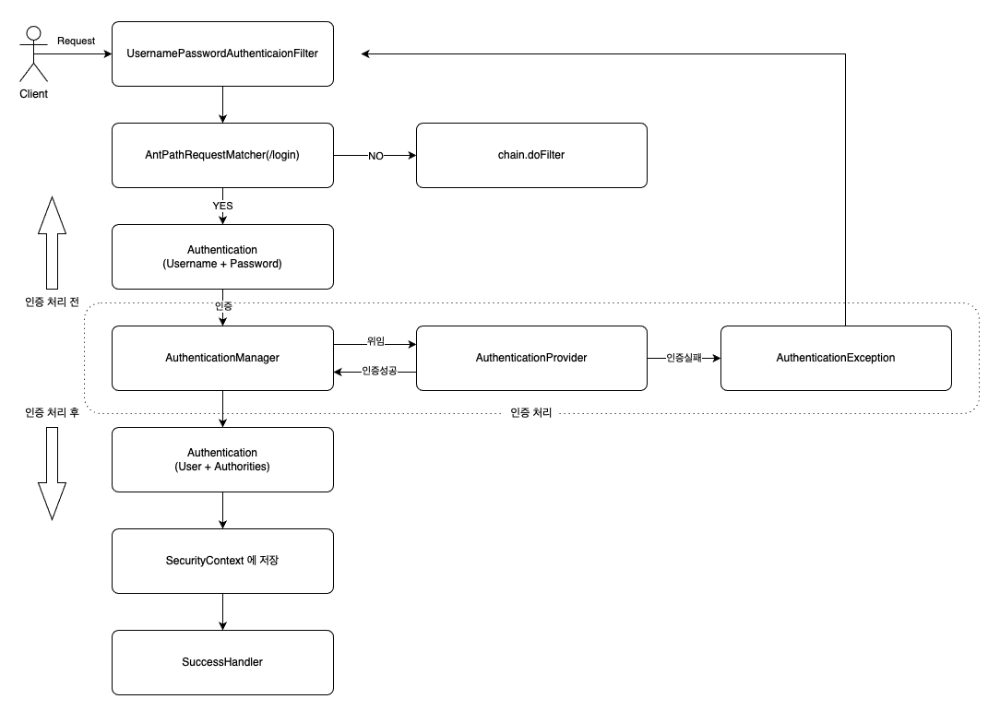
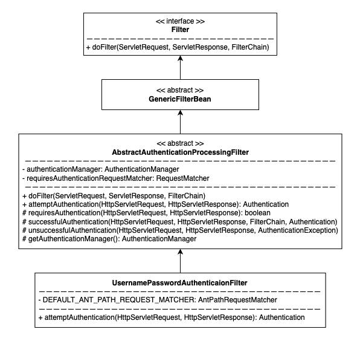
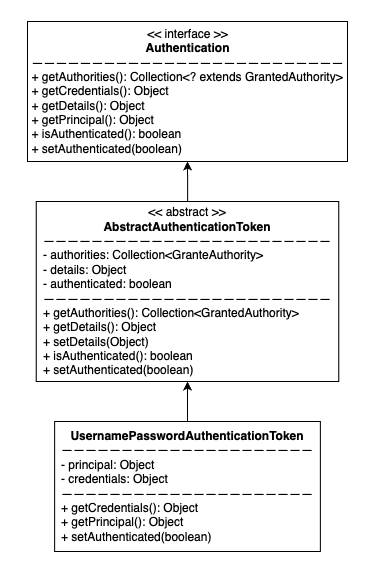
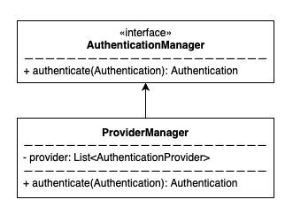
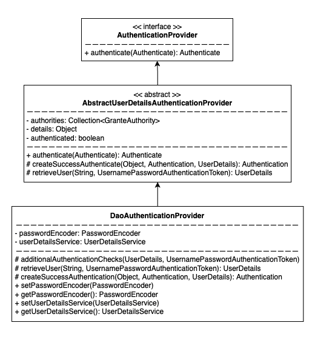

# Hello Security 02

### 기능
- 사용자 정의 보안 기능 구현 (SecurityConfig)
- Form Login 인증
  - UsernamePasswordAuthenticationFilter

### 주요 내용

#### UsernamePasswordAuthencationFilter 인증 처리 과정

### 인증 처리 과정중에 관여하는 클래스

- UsernamePasswordAuthenticationFilter

- Authentication

- AuthenticationManager

- AuthenticationProvider
